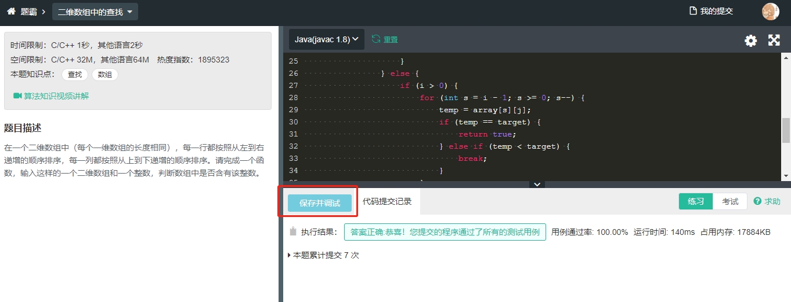

# 关于算法方面的练习
## 以下算法题来自[牛客网](https://www.nowcoder.com/ta/coding-interviews)的剑指offer
如果想测试自己的代码编写得是否有问题，可以将代码拷贝到牛客网上进行测试。如下图，点击图中的“保存并调试”就可以查看是否能通过所有案例。

### 二维数组中的查找
在一个二维数组中（每个一维数组的长度相同），每一行都按照从左到右递增的顺序排序，每一列都按照从上到下递增的顺序排序。请完成一个函数，输入这样的一个二维数组和一个整数，判断数组中是否含有该整数。  
- [我的练习](src/main/java/Practice1_1.java)
- [目前发现的最佳思路](https://github.com/CyC2018/CS-Notes/blob/master/notes/4.%20%E4%BA%8C%E7%BB%B4%E6%95%B0%E7%BB%84%E4%B8%AD%E7%9A%84%E6%9F%A5%E6%89%BE.md)  